# Darren Daly Carolan Memory Game
## Purpose

This is my second milestone project I have done as part of Code Institute's Full Stack software development course which I am doing
through Kerry ETB.

I decided to do the memory game as to challenge myself and what i have learned in html, css and javaScript trying to see my knowledge of the javaScript library Jquery.

## Active link
<!-- [A live version of my Memory Game](https://darrendc-dev.github.io/darrendc-first-milestone/#home)  -->

# User Expierence( UX )

This is a very clean and well layed out website which is a great demonstration of skill and eye friendly content of which won't be hard on the eyes or get to bland
after spending extended periods of time on it.

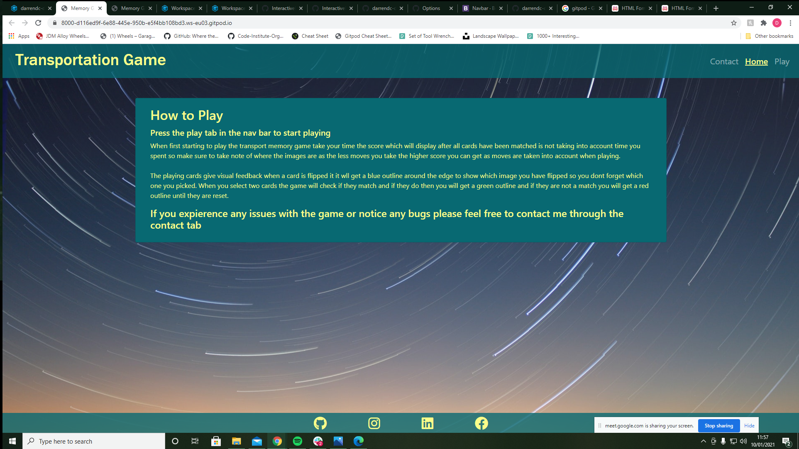
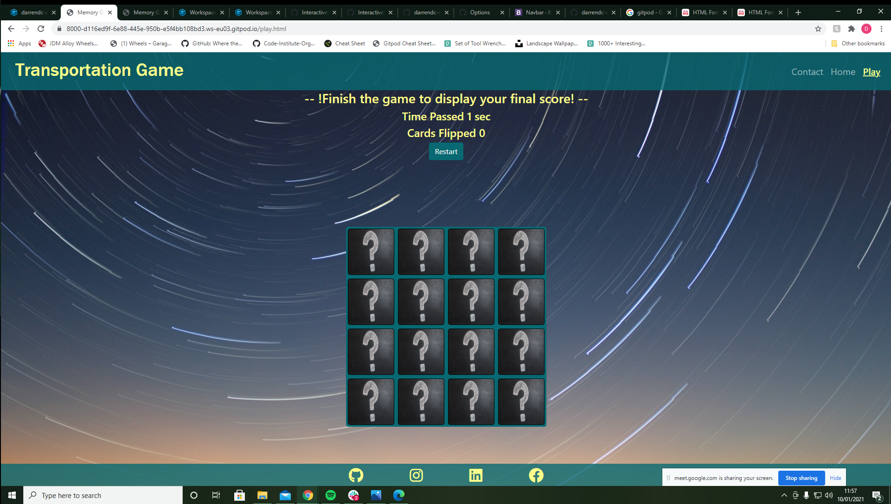
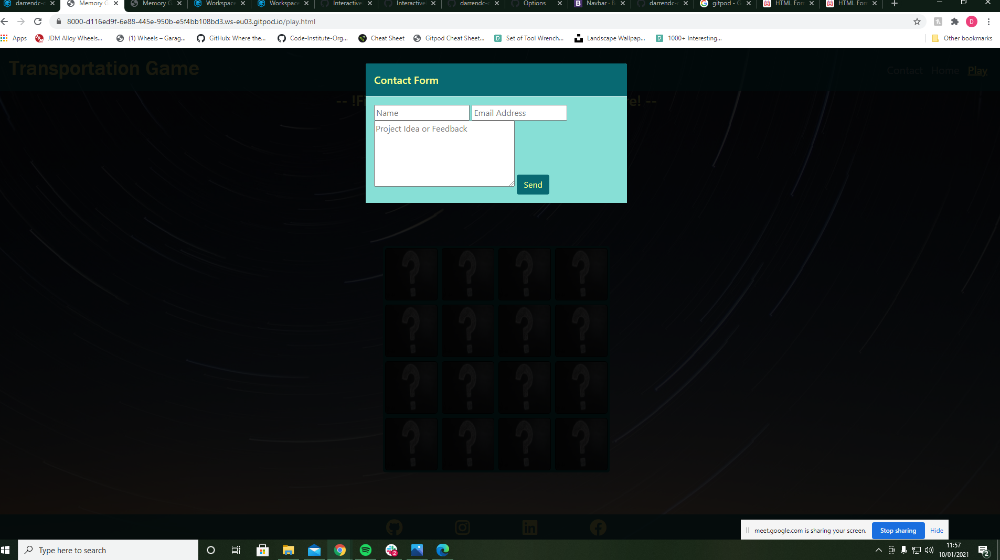

## 5 Planes of UX

#### Strategy
My personal goal for this project was to create a nice clean website with smooth navigation and transition between
pages meaning very little time would be spent by players trying to find their way around the website while still being informative.

#### Scope
The plan for this website was to allow new players to become the casual visitors and allow them to bring their friends
and family to try beat each others score allowing me to build a player base from nothing. So the layout of the website was very
important as new players would not stay if they couldn't find the game content which they were looking for.

#### Structure
Structurally the website was designed so that the information that was being given wasn't to much and the information that was given had to look visually pleasing
and nicely laid out. I placed a footer on the bottom which allows for some social media links and link to my GitHub for those that want to have a look at 
my previous or future projects.

#### Skeleton
I started by drawing a rough outline of what my desired layout would look like and was planning on doing 
a 3 page layout but I cut it back to 2 by using a modal for the contact info.

#### Surface
The background image for the website was picked due to the nice colours it displays and a very subtle design.

## Users Expierences

#### Player
As a new player, I was presently suprised landing on the website to be greeted by a how to and the instructions required to play.

As a returning player I find the website to be very eye pleasing and easy to look at its not very in your face.

# Development
The development of this project was all carried out using GitHub and Gitpod to allow for ease of version control and testing.

1. I started by doing a quick hand drawing for the wireframe to figure out layout I was looking for.
2. I then progressed to doing some research on what would be expected from the game by looking at other memory games online.
3. I started a new repository on GitHub to allow for version control and the use of GitHub pages.
4. I started using Gitpod along with bootstrap to allow for a nice basic layout for the page which I could expand on towards the end.
5. I then moved on to the game in javaScript to start developing the basic funtions like the flipCard and cardCheck funtions.
6. After I was happy with the basic funtions I started playing the game looking for ways to cheat the game.
7. When I was happy with the way the game played I moved onto changing the look through the development of my css page.

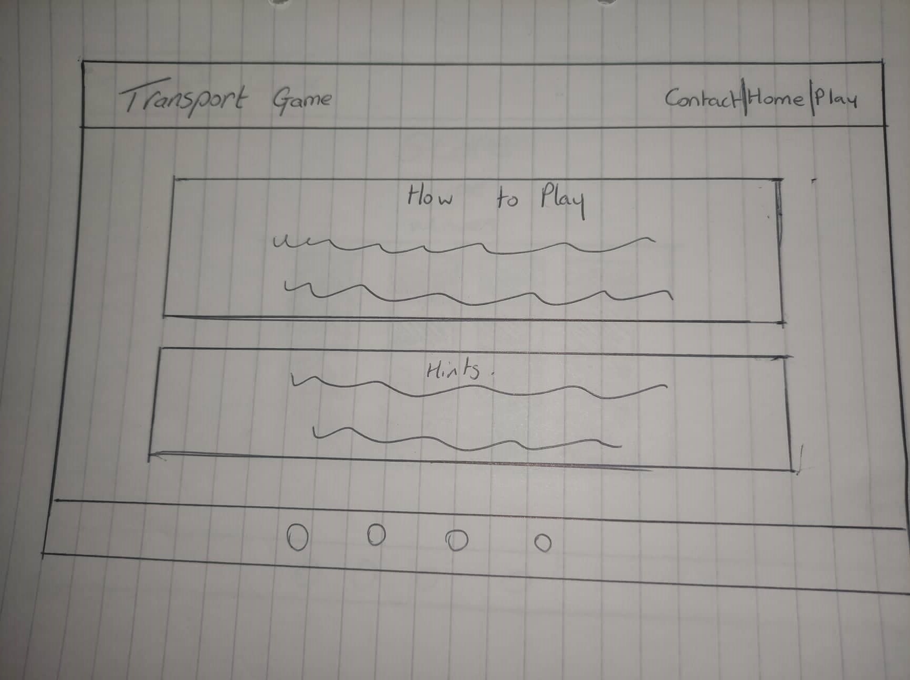
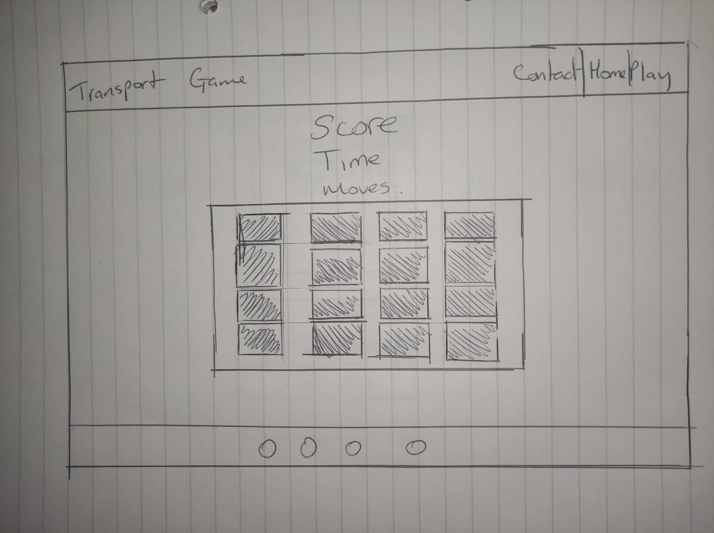
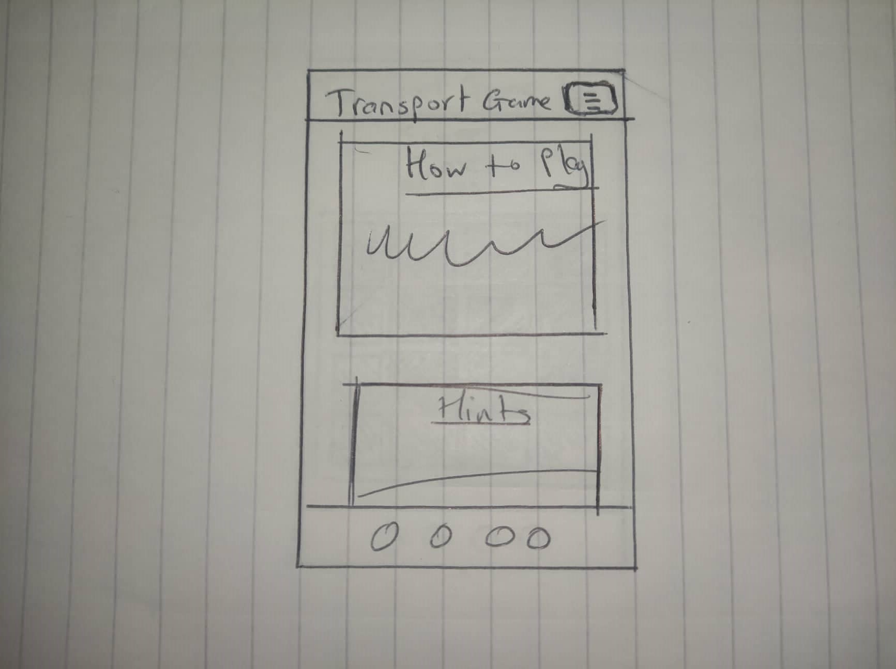
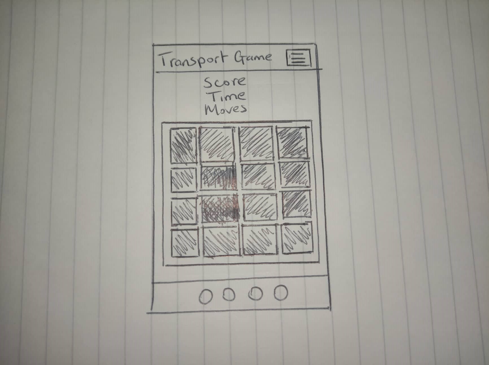

# Validator
While doing the last few small fixes and looking for as many mistakes as I could, I started validating and formating the project I validated my CSS using [W3C](https://jigsaw.w3.org/css-validator/validator)
I then used [W3](https://validator.w3.org/nu/#l61c45) for HTML and finally [JSHint](https://jshint.com/) for Jquery

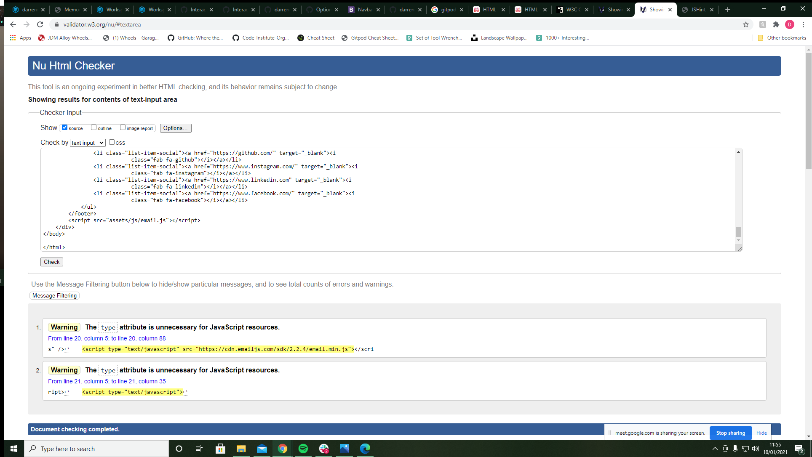

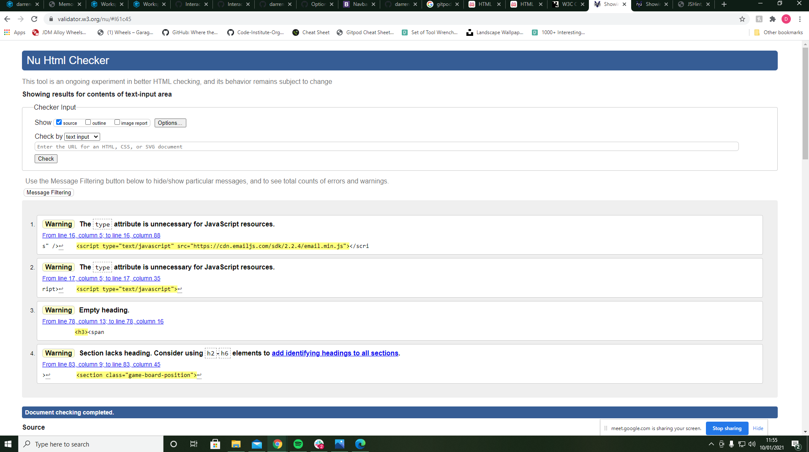

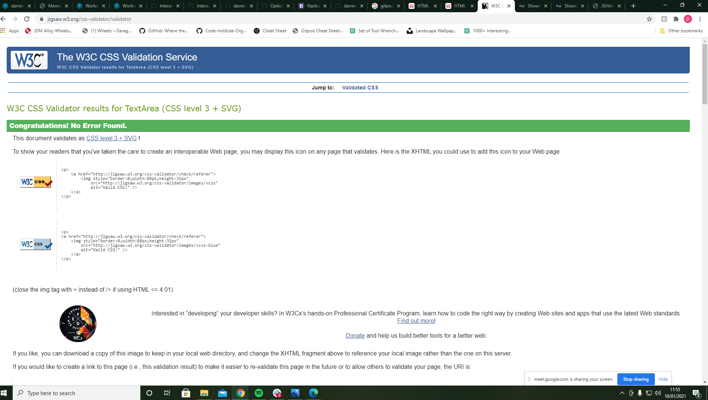

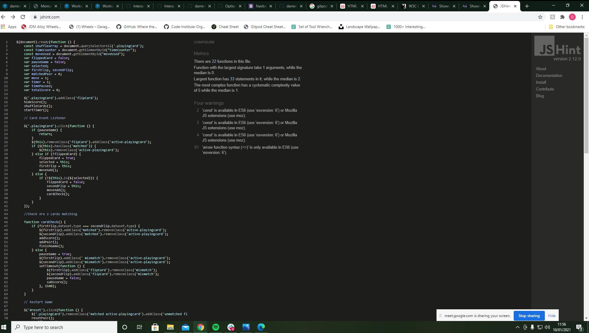

# Testing
The testing for this project was a long and tedious job as it was my first time testing javaScript manually.

## Reselecting already matched cards
While testing my javaScript I found that you could match already matched cards due to the way I wrote my code so i went back and added a if statement
to check if the card selected already had the class match if it did it would remove the active-playingcard class which is what was assigned when it was
clicked so wouldnt let you reselect cards which had already been matched solving my issue.

## Manual Testing
There was a lot of work went into the testing of this project:

* The game plays as intended
* The score shows at after the game finishes
* The cars can only be matched once
* The cards are randomaly shuffled
* Had family test weither it was enjoyable or not

# Deployment
My Project is deployed using GitHub pages and is updated when I push from Gitpod after commiting all the changes.

I was also using a web browser preview command in the cli by typing "python3 -m http.server"

# Future Ideas
## Making some of the features smoother
I would like to go back when I get a bit better with javaScript to go back and add a bit more animation to feature's such as the flipCard function.

## Allowing for a scoreboard
I would like add a scoreboard which logs usernames and stores data to allow for peoples achievements to be displayed

# Websites and Services Used
All images used in this project were taken from [Pexels](https://www.pexels.com/)

I used [Bootstrap](https://getbootstrap.com/) to allow for creating the basic webpage and some of the features it off in the responsive design.

All the social link images are from [Fontawesome](https://fontawesome.com/).

I used the [JQuery](https://code.jquery.com/) javaScript library for the ease of writing and to try increase my knowledge of the library.

When I got stuck or googled a question I would always look for the first [stackoverflow](https://stackoverflow.com/) result as I find alot of question's I would
asking myself someone would have already asked and answered on there.

# Credits
I would like to thank Roman my in-class tutor for helping me with some small 
issues and always leading me to the error. I would also like to thank Code Institute's tutor support for
helping me with other small issues.